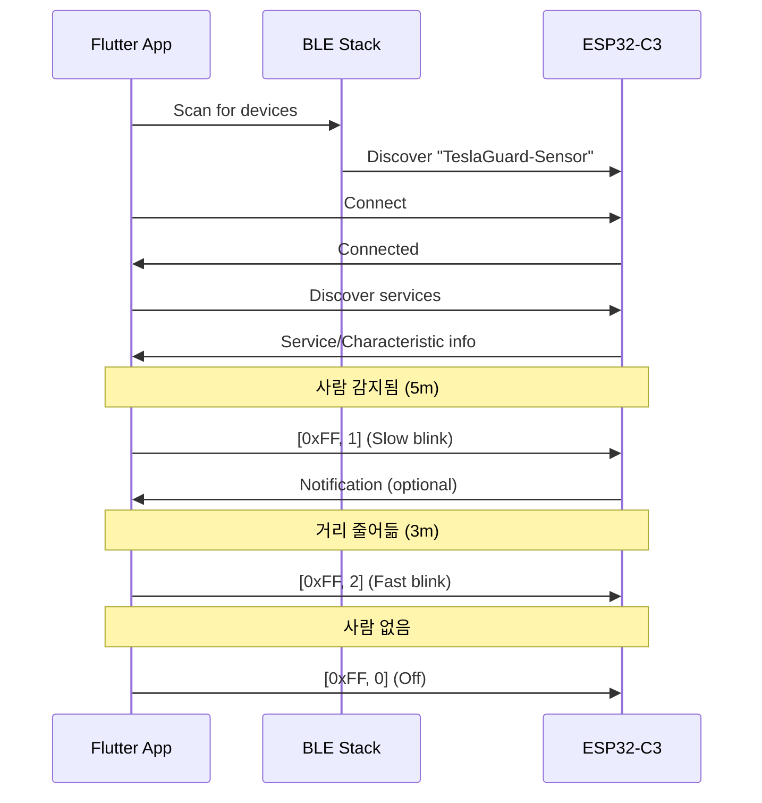

# TeslaGuard Communication Protocol

Tesla Charging Guard 시스템의 Flutter 앱과 ESP32-C3 하드웨어 간 통신 프로토콜 명세입니다.

## 개요

- **통신 방식**: Bluetooth Low Energy (BLE)
- **방향**: 양방향 (앱 ↔ 하드웨어)
- **인코딩**: Binary (byte array)

## BLE 설정

### Service
```
UUID: 4fafc201-1fb5-459e-8fcc-c5c9c331914b
Type: Primary Service
```

### Characteristic
```
UUID: beb5483e-36e1-4688-b7f5-ea07361b26a8
Properties: READ | WRITE | NOTIFY | INDICATE
```

## 명령 프로토콜

### 1. LED 제어 명령 (앱 → 하드웨어)

#### 포맷
```
[0xFF] [mode]
```

#### 필드 설명
| Byte | 이름 | 타입 | 설명 |
|------|------|------|------|
| 0 | Marker | uint8 | 항상 `0xFF` (LED 명령 식별자) |
| 1 | Mode | uint8 | 0=OFF, 1=SLOW, 2=FAST |

#### Mode 값
| 값 | 이름 | 동작 | 용도 |
|---|------|------|------|
| `0` | OFF | LED 끄기 | 경고 없음 |
| `1` | SLOW | 1초 간격 깜빡임 | 3-5m 경고 |
| `2` | FAST | 0.5초 간격 깜빡임 | 3m 이내 긴급 경고 |

#### 예시
```dart
// Slow blink (1s interval)
characteristic.write([0xFF, 1]);

// Fast blink (0.5s interval)
characteristic.write([0xFF, 2]);

// Turn off
characteristic.write([0xFF, 0]);
```

### 2. 경고 레벨 명령 (앱 → 하드웨어) - 미래 확장

#### 포맷
```
[level]
```

#### 필드 설명
| Byte | 이름 | 타입 | 설명 |
|------|------|------|------|
| 0 | Level | uint8 | 0=None, 1-3=Warning levels |

*현재는 LED 제어만 사용, 향후 확장 가능*

### 3. 근접 거리 데이터 (하드웨어 → 앱) - 미래 확장

#### 포맷
```
[distance_high] [distance_low]
```

#### 필드 설명
| Byte | 이름 | 타입 | 설명 |
|------|------|------|------|
| 0-1 | Distance | uint16 | 거리 (cm 단위, Big-endian) |

*현재는 앱의 카메라 기반 감지를 사용, 향후 하드웨어 센서 추가 가능*

## 연결 시퀀스



## 에러 처리

### 연결 실패
- **원인**: Bluetooth Off, 권한 없음, 범위 밖
- **처리**: 자동 재연결 시도 (최대 3회)

### 연결 끊김 (Auto-Reconnection)
- **감지**: BLE 연결 상태 모니터링
- **지연**: 5초 대기 후 재연결 시도
- **재시도 횟수**: 최대 3회
- **로깅**: 모든 재연결 시도를 상세히 기록
- **실패 시**: 사용자에게 수동 재연결 요청 메시지

**재연결 시나리오:**
1. 펌웨어 업데이트 후 ESP32-C3 재부팅
2. 일시적인 Bluetooth 신호 끊김
3. ESP32-C3 전원 재시작

### 쓰기 실패
- **원인**: 연결 끊김, Characteristic not writable
- **처리**: 재연결 후 재시도

### 타임아웃
- **값**: 15초
- **처리**: 연결 끊기 및 자동 재연결 시도

## 성능 특성

| 항목 | 값 | 비고 |
|------|-----|------|
| **최대 연결 거리** | ~10m | 실내 환경 기준 |
| **명령 지연시간** | <100ms | BLE 특성상 변동 가능 |
| **재연결 시간** | 2-5초 | 디바이스 상태에 따라 변동 |
| **배터리 수명** | TBD | 사용 패턴에 따라 달라짐 |

## 보안

- **페어링**: 현재 미사용 (향후 추가 가능)
- **암호화**: BLE 기본 암호화 사용
- **인증**: Device name으로 식별

## 버전 관리

| 버전 | 날짜 | 변경사항 |
|------|------|---------|
| **1.0** | 2025-10-14 | 초기 프로토콜 정의 - LED 제어 |
| **1.1** | 2025-10-14 | 자동 재연결 기능 추가 - 펌웨어 업데이트 후 자동 복구 |

## 미래 확장 계획

1. **하드웨어 센서 통합**
   - 초음파/ToF 센서로 거리 측정
   - 앱과 센서 데이터 융합

2. **다중 디바이스 지원**
   - 2x2 그리드 위치 정보 전송
   - 디바이스 간 동기화

3. **설정 저장**
   - LED 밝기 조절
   - 경고 임계값 설정

4. **펌웨어 OTA 업데이트**
   - BLE를 통한 무선 업데이트
